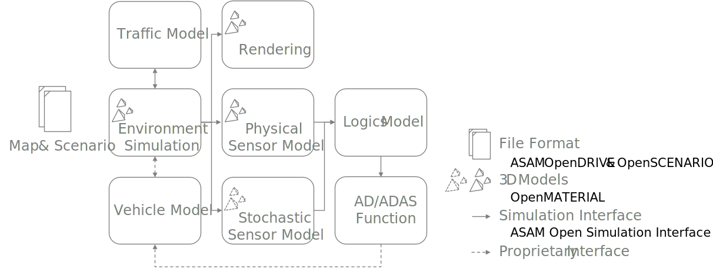

OpenMaterial
============

In virtual development, test and validation of automated and autonomous driving systems, 3D models are used for the geometric representation of the environment of simulated vehicles as well as for the vehicles themselves. For a long time, physical correctness in the visual representation of those geometries was not fundamental. Due to limited computing capacities, implementations were designed for lowest possible memory and computing time requirements while providing a visually plausible appearance. 

For physical sensor simulation, which is becoming increasingly important in the context mentioned above, this approach is suitable to a limited extent. Instead of visual plausibility, physically correct modelling of material properties is fundamental in order to achieve valid results [[1]](#[1]). Besides sensor simulation, modern rendering solutions also require physical material properties in 3D models in order to be able to reproduce physically correct lighting, reflections and shadowing.

The specific architecture of a simulation framework used in the above-mentioned context poses further demand for action. Within the framework, which may be set up distributed over several compute nodes, subsystems such as an environment simulation, rendering and sensor models are implemented as individual software components [[2]](#[2]). Internally, these components use non-standardized 3D models to represent the environment and road users, each for its specific purpose. This circumstance may lead to inconsistencies in the representation of the virtual world and complicates both the maintenance and scalability of the approach:

 

As depicted, in the context of distributed simumlation frameworks, some interfaces and file formats have already been standardized, thus simplifying modularity and exchangeability. Examples are [ASAM OpenDRIVE](https://www.asam.net/standards/detail/opendrive/), [ASAM OpenSCENARIO](https://www.asam.net/standards/detail/openscenario/) and the [ASAM Open Simulation Interface](https://www.asam.net/standards/detail/osi/). A 3D model exchange format, model structure, physical material properties and their annotation in corresponding 3D models is not yet standardized in this context. This results in ongoing integration efforts as well as incompatibilities and inconsistencies among software components.

The above-mentioned circumstances led to the establishment of the project **OpenMaterial**. Overall goal of the project is the development of a generic, standardized 3D model exchange format and model structure with physically correct description of materials for rendering and sensor simulation. For this purpose, this repository contains proposals for extensions to the [Khronos Group glTF 2.0](https://github.com/KhronosGroup/glTF) file format. Usage of the proposed extensions is demonstrated by a raycaster / pathtracer implementation and a collection of example files for objects and materials. A proposal on 3D model structure complements the development:

| Filepath                              | Description
|:--------------------------------------|:------------------------------------------------------------------------------------------------------------------------------------------|
| [`external`](external/)               | Third-party dependencies |
| [`glTF_extensions`](glTF_extensions/) | Proposed glTF extensions defining asset properties, providing physically correct material descriptions and enabling glTF file referencing |
| [`hdr`](hdr/)                         | Examples of HDR (high dynamic range) images |
| [`materials`](materials/)             | Examples of glTF materials using the proposed glTF extensions |
| [`model_structure`](model_structure/) | Proposal on 3D model structure (quality criteria, node hierarchy, transforms,...) |
| [`objects`](objects/)                 | Examples of glTF 3D objects using the proposed glTF extensions |
| [`pathtracer`](pathtracer/)           | Implementation of a raycaster / pathtracer using the proposed glTF extensions |

References
----------
[1] V. Kurz, L. Friedmann, C. van Driesten and E. Biebl, "Physically based radar simulation parameter of road surfaces in OpenMATERIAL," 2022 3rd URSI Atlantic and Asia Pacific Radio Science Meeting (AT-AP-RASC), Gran Canaria, Spain, 2022, pp. 1-2, doi: 10.23919/AT-AP-RASC54737.2022.9814181.

[2] L. Friedmann, S. Reiter and C. Linnhoff, "SUC 3 - Open-Loop Sensor Simulation for Component Test: Radar-based Tracking," presented at SET Level Final Event, Munich, Germany, 2022.
