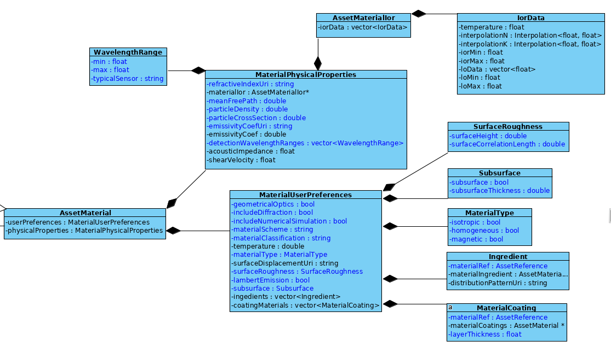

OpenMaterial_material_parameters
================================

This is a proposal for an extension to the [Khronos Group glTF 2.0](https://github.com/KhronosGroup/glTF) specification. The goal of this extension is to provide a
physically accurate description of materials under different wavelengths.

**OpenMaterial_material_parameters**  addresses the physics of wave-matter interaction. It uses physical properties of
materials to describe their behavior for various environmental conditions. This physical material model works for different
sensors such as camera, lidar and radar. The extension allows the material model to be used by multiple sensors in parallel.

Various physical concepts are considered, such as geometrical optics for the visible spectrum (camera sensors) and uniform
theory of diffraction and physical optics for millimeter and sub-millimeter range (radar sensors). These concepts are used in
their validity region to cover the full-wave spectrum. The proposed physical concepts and their implementation are
independent of geometry.

In order to use this extension, it has to be listed in the ``extensionsUsed`` section of the corresponding asset:
```
"extensionsUsed" : [
    "OpenMaterial_material_parameters"
]
```

Properties
----------

The material properties used within the extension are defined based on the material model. This list of parameters not only
includes physical properties of the material but also allows differentiation of surface, volume and subsurface interactions. 
Physical properties of a material are stored in the same file, regardless of the type of sensor. A particular class (i.e.
WavelengthRange) defines if the material is detectable from the specific type of sensor, which is used to render the scene,
through a window of valid wavelenghth values.

The index of refraction (IOR), Poynting Vector, Snell and Fresnel laws (geometric options) and coating (interference) are the
material properties describing the surface interactions. In contrast, the mean free path, particle density, absorbtion and
particle cross section are parameters describing volume interactions.  For radar sensors, besides geometrical optics
calculations, diffraction models and possibly numerical simulations can be included in the wave-matter interaction. Surface
roughness is defined by the surface height root-mean-square (rms) and correlation length both in the unit of micrometer.
A definition of all above mentioned parameters enables usage of a material for camera, lidar and radar simulations.

Within the following enlistment of properties specified by the proposed extension, items labeled as **required** are
mandatory and must be present. Properties without **required** label are optional and may be omitted:

* **`user_preferences`** [**required**]
Material properties that could change when material is applied to geometry.
  - **`geometrical_optics`** [boolean][**required**]
  If true, geometrical optics will be used. This is valid assumption when the size of the geometry structure of the
  object is much larger than the incident wavelength. [-]
  - **`include_diffraction`** [boolean][**required**]
  If true, diffraction models will be included in the interaction calculations. Examples of methods are Unified Theory
  of Diffraction (UTD) - Geometrical Theory of Diffraction (GTD). [-]
  - **`include_numerical_simulation`** [boolean][**required**]
  If true, numerical methods will be used to compute the electromagnetic field. Examples of methods are BEM
  (Boundary Elements Method), FEM (Finite Element Method), FDTD (Finite Difference Time Domain), and
  FMM (Fast Multiple Method). [-]
  - **`material_scheme`** [string][**required**]
  Valid options are `surface`, `subsurface` and `volume`. [-]
  - **`material_classification`** [string][**required**]
  Property specifying the hierarchical classification of the material. The first hierarchy level is either `solid`, `liquid`
  or `gas`. Lower hierarchy levels are user-defined. Hierarchy levels are separated by the `–` sign, e.g.
  `solid-metal-aluminium`. [-]
  - **`material_type`** [**required**]
    - **`isotropic`** [boolean][**required**]
	If true, it will be assumed that the material's physical properties are independent of the incident direction.
	This is true for most metals and glasses. If the property is set to false, anisotropic material behavior (including
	orthotropic) will be considered. Then the input parameters should be provided as a function of the incident
	direction. [-]
    - **`homogeneous`** [boolean][**required**]
	If false, non-homogeneous material (a variation of physical properties varies inside the material will be
	considered. Physical properties have to be provided accordingly. [-]
    - **`magnetic`** [boolean][**required**]
	If true, it is assumed that the material has magnetic properties. If false, the material is assumed to be
	non-magnetic. [-]
  - **`temperature`** [number]
  Material base-temperature [K] (T(°C) = T(K) - 273.15). Some assets have varying temperatures e.g.
  pedestrians, vehicle parts, ice, snow, rain.
  - **`lambert_emission`** [number][**required**]
  A Lambertian emitter has the same brightness (i.e. current per area per solid angle) when observed from all angles.
  Lambertian emission follows the Lambert's cosine law. Value "0" means that the property is not used, while "1"
  enables it. [-]
  - **`subsurface`** [**required**]
    - **`subsurface`** [boolean][**required**]
	If true, subsurface interactions will be considered on top of surface interactions. [-]
    - **`subsurface_thickness`** [number][**required**]
	Thickness of the volume to be considered as subsurface. The default value is the penetration depth
	calculated by the material model. [μm]
  - **`surface_displacement_uri`** [string]
  URI of external file with displacement data. Surface displacement is the macro-surface pattern. Assets with
  multiple displacements should be linked to their appropriate "displacement group". [-]
  - **`surface_roughness`** [**required**]
  Surface roughness is defined by the surface root-mean-square and the correlation length.
    - **`surface_height_rms`** [number][**required**]
	Surface height root-mean-square. [μm]
    - **`surface_correlation_length`** [number][**required**]
	Surface correlation length. [μm]
  - **`coating_materials`** [array]
  Coating refers to a layer of transparent or semi-transparent material on top of another material, e.g. a layer of oil or
  water on top of asphalt. Each array element has the following properties:
    - **`material_ref`** [string][**required**]
	Reference to an external material. [-]
    - **`layer_thickness`** [number][**required**]
	Thickness of the coating layer. [μm]
  - **`ingredients`** [array]
  Ingredients are considered as impurities on top of the main material, e.g. oxidization is consiedered an ingredient of
  metal. Each array element has the following properties:
    - **`material_ref`** [string][**required**]
	Reference to an external material. [-]
    - **`distribution_pattern_uri`** [string]
	Reference to an external map of material distribution which describes the distribution of material ingredients
	over geometry. [-]

* **`physical_properties`** [**required**]
Intrinsic physical material properties that do not change when material is applied to geometry.
  - **`refractive_index_uri`** [string][**required**]
  URI of an external file with tabular refractive index data. The refractive index is a complex function N (n + ik) that
  depends on the temperature and the wavelength. [-] There is a functional relationship between refractive index, relative
  permeability and relative permittivity. Depending on the area of application, either the refractive index or the relative
  permeability and relative permittivity should be used.
  - **`mean_free_path`** [number][**required**]
  Mean free path for volumetric materials [μm]. The mean free path is the average distance travelled by
  light until it scatters at a scatterer. Value 0 indicates the property is not used.
  - **`particle_density`** [number][**required**]
  Density of scatterers in a volume [μm^3]. Value 0 indicates the property is not used.
  - **`particle_cross_section`** [number][**required**]
  Effective cross section of scatterers in a volume [μm^2]. Value 0 indicates the property is not used.
  - **`emissive_coefficient_uri`** [number][**required**]
  URI of an external file with emissivity coefficient values [-]. An ideal black body has the emissivity coefficient of 1.0.
  - **`detection_wavelength_ranges`** [array][**required**]
  Array of wavelength ranges in which the material can be detected by sensors. Each array element has the following properties:
    - `min` [number][**required**]
	Minimum wavelength [m].
    - `max` [number][**required**]
	Maximum wavelength [m].
    - `typical_sensor` [string][**required**]
	Sensor type corresponding to the wavelength range. Valid options are: `camera`, `lidar`, `radar` and `ultrasound`. [-]
   - **`effective_particle_area`** [number][**required**]
   Effective particle area of a material. This value is required for radar simulation. [μm]
   - **`relative_permittivity_uri`** [string][**required**]
   Ratio of the capacitance of a capacitor using that material as a dielectric, compared with a similar capacitor that has
   vacuum as its dielectric. Relative permittivity is also commonly known as the dielectric constant and is required for
   radar simulation. This strings represents the URI of an external file with tabular complex relative permittivity data. The
   data is structured by incident angle, temperature and wavelength. [F/m] There is a functional relationship between
   refractive index, relative permeability and relative permittivity. Depending on the area of application, either the
   refractive index or the other two values should be used.
   - **`relative_permeability_uri`** [string][**required**]
   Denoted by the symbol μ_r, relative permeability is the ratio of the permeability of a specific medium to the
   permeability of free space μ0. In SI units, μ_r is measured in henries per meter (H/m), or equivalently in newtons
   per ampere squared (N⋅A−2). This value is required for radar simulation. This strings represents the URI of an
   external file with complex tabular relative permeability data. The data is structured by incident angle, temperature and
   wavelength. [H/m] There is a functional relationship between refractive index, relative permeability and relative
   permittivity. Depending on the area of application, either the refractive index or the the other two values should be
   used.   
   - **`conductivity_uri`** [string][**required**]
   Conductivity quantifies how a material conducts electric current. The SI unit of electrical conductivity is 
   Siemens per meter (S/m). This value is required for radar simulation. This strings represents the URI of an
   external file with tabular conductivity data. [-]
   - **`acoustic_impedance`** [number][**required**]
   Acoustic impedance describes how much resistance an ultrasound beam encounters as it passes through a tissue
   [kg/(m^2s)]. This value is required for ultrasound simulation.
   - **`shear_velocity`** [number][**required**]
   Shear velocity is used to describe shear-related motion in moving fluids. This value is required for ultrasound
   simulation. [m/s]
   
Wave-matter interaction
-----------------------

Within this project, wave-matter interaction is demonstrated based on the proposed material model for the case of perfectly
smooth aluminium and gold. This demonstration considers camera sensors and implements Fresnel equations for surface
interactions in visible light.

Visible light (light) is the electromagnetic radiation in the spectrum of 390 to 700 nanometers. Light interaction with material
depends on the physical properties of the material. These physical properties can be measured and are provided in physics
and chemistry literature. In the case of specular reflection, the Fresnel equations are used to describe how much of the
incident ray is reflected and refracted. The Fresnel equations satisfy the energy conservation, so the total amount of the
reflected and refracted light is equal to the incoming light. The angle of the refracted ray is given by Snell's law. Both
the Fresnel equations and Snell's law depend on the index of refraction (IOR) which is a function of temperature and
wavelength.

The index of refraction is a complex function which has a real and an imaginary part. The real part accounts for refraction,
while the imaginary part describes the light attenuation. Instead of experimental data, the index of refraction can also be
described by theoretical models such as the Lorentz oscillator model. This model provides a good description for many
materials like metals, water, polystyrene, mercury, or silicone at wavelengths typically bigger than one micrometer.


Texture based displacement
--------------------------

The surface of geometry files can be manipulated by applying distortion of the normals and vertexes position of the
meshes. This effect can be controlled by mapping displacement textures to the geometry. The former are gray-scale/
coloured pictures associating the distortion of the displacement as a function of the local coordinate u and v.
In this context, the displacement direction is the local surface normal. Brighter textures will lead to higher displacement. 

Code Structure
--------------

In the following image, the material model structure is presented:


Material composition and assignment of physical  properties is defined using the following two building blocks:

```
AssetMaterial:
 1) userPreferences: (MaterialUserPreferences)
    -SurfaceRoughness
      ...
    -Subsurface
      ...
    -MaterialType
      ...
    - Ingredients
      ...
    -CoatingModels
      ...
    ...
 2) physicalProperties: (MaterialPhysicalProperties)
    -AssetMaterialIor
        -IorData
          ...
    -WavelenghtRange
        ...
    ...
```

Example
-------

Within its `material` section, the file describing the geometry of a 3D model has to provide a reference to a file based on the
**OpenMaterial_material_parameters** extension and therefore providing physical material parameters and the description of
the material:

```
"materials" : [  
        {  
            "name" : "aluminium",  
            "extensions": {  
                "OpenMaterial_reference_link": {  
                    "id": "a3a62d4531e64ae5a620030b1deaff7c",  
                    "title": "aluminium",  
                    "uri": "../materials/aluminium.gltf"   <======  
                }  
            }  
        }  
    ],  
```

This way, the same material can be used by different geometries (i.e. 3D models, meshes, etc.):   

```  
    "meshes": [  
        {  
            "primitives": [  
                    "indices": 0,  
                    "mode": 4,  
                    "material": 0 <======  
                }  
            ],  
            "name": "body_115"  
        },  
        {  
            "primitives": [  
                    "indices": 3,  
                    "mode": 4,  
                    "material": 0 <======  
                }  
            ],  
            "name": "body_72"  
        },  
```

The physical parameters provided in the referenced material file (e.g. `aluminium.gltf`, `iron.gltf` or `gold.gltf`) are used to
compute reflection of rays at the geometry (see above sections "Properties" and "Code structure"):

```
    "materials": [
        {
            "name": "aluminium",
            "extensions": {
                "OpenMaterial_material_parameters": {
                    "user_preferences": {
                        "geometrical_optics": true,
                        "include_diffraction": false,
                        "include_numerical_simulation": false,
                        "material_scheme": "surface",
                        "material_classification": "solid-metal",
                        "material_type": {
                            "isotropic": true,
                            "homogeneous": true,
                            "magnetic": false
                        },
                        "temperature": 300.0,
                        "surface_displacement_uri": "",
                        "surface_roughness": {
                            "surface_height": 0.0,
                            "surface_correlation_length": 0.0
                        },
                        "coating_materials": [],
                        "lambert_emission": 0.0,
                        "subsurface": {
                            "subsurface": false,
                            "subsurface_thickness": 0.0
                        "ingredients": []
                        },
                    },
                    "physical_properties": {
                        "refractive_index_uri": "data/aluminium_ior.gltf",
                        "mean_free_path": 0.0,
                        "particle_density": 0.0,
                        "particle_cross_section": 0.0,
                        "emissive_coefficient_uri": "",
						"detection_wavelength_ranges": [
							{
								"min": 0,
								"max": 1E06,
								"typical_sensor": "camera"
							}
                        "effective_particle_area": 0.0,
						"relative_permittivity_uri": "",
						"relative_permeability_uri" : "",
						"conductivity_uri": "",
                        "acoustic_impedance": 0.0,
                        "shear_velocity": 0.0
						],
                    }
                }
            }
        }
    ],
````
In the given example, wavelength and temperature specific refractive index values (i.e. `aluminium_ior.gltf`) are specified
in a  separate file using the [`OpenMaterial_ior_data`](../OpenMaterial_ior_data/) extension.

To represent emissivity, the [`OpenMaterial_emissivity_data`](../OpenMaterial_emissivity_data/) extension can be used.

Relative permeability and relative permittivity are defined by extensions [`OpenMaterial_permeability_data`](../OpenMaterial_permeability_data/) and
[`OpenMaterial_permittivity_data`](../OpenMaterial_permittivity_data/).

glTF Schema Updates
-------------------
N/A

JSON Schema
-----------
[OpenMaterial_material_parameters.schema.json](schema/OpenMaterial_material_parameters.schema.json)

Known Implementations
---------------------
N/A
