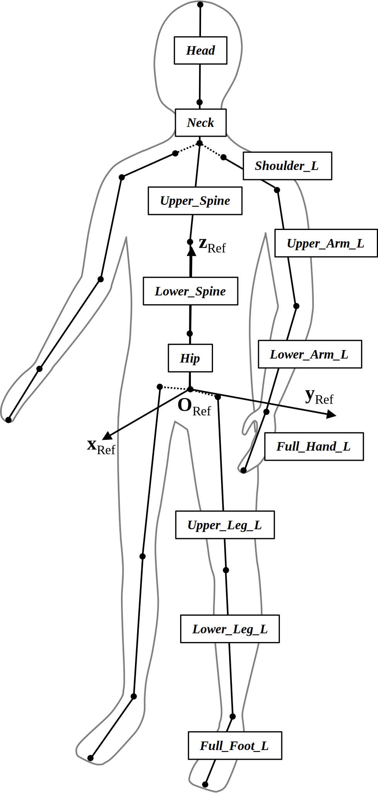
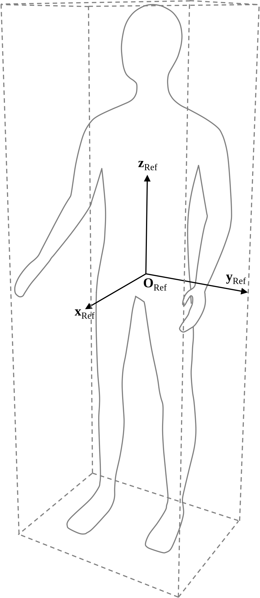

3D Model Structure
==================

# Pedestrians

## 1.	Introduction

The following specification describes properties and a proposed model structure for 3D pedestrian models in real-time simulation usage.

## 2.	General

Models shall be provided in the [Khronos glTF 2.0](https://github.com/KhronosGroup/glTF) file format. Their creation process shall comply with the requirements defined in [chapter 3](#3model-creation). All models shall be based on a skeleton of bones and a corresponding skinned mesh representing the human body. Hair and clothing shall be modelled by separate, skinned meshes as individual nodes. Equipment shall be modeled as separate, switchable nodes. Non-visible parts of pedestrians, their clothing or equipment shall not be modeled. Joints and gaps shall be backfilled to prevent light bleeding.

Anticipating the quality requirements for model creation defined in [chapter 3.1](#31quality-requirements), here, some major requirements for the corresponding meshes are outlined:

*	Hierarchical bone structure for skeletal animation (skeleton)
*	Vertex skinning to model the human body, hair, and clothing in separate meshes
*	Manual optimization (if required)
*	Consistent normals
*	Clean, optimized UV layout
*	Tile-able textures
*	Homogeneous distribution of vertices
*	No gaps or holes 

Model node structure shall comply with the structure presented in [chapter 3.2](#32model-structure). For external animation of the body, hair, clothing and body-fixed equipment, a skeleton of bones shall be implemented. The hierarchical structure of the bones starts with the hip bone and then follows the limbs to the crown, hands, and feet. Within this hierarchy, bones can be parented physically connected or parented with an offset. The skeleton comprises the following bones and corresponding transforms:

*	Hip
*	Lower Spine
*	Upper Spine
*	Neck
*	Head
*	Shoulder (Left and Right)
*	Upper Arm (Left and Right)
*	Lower Arm (Left and Right)
*	(Full) Hand (Left and Right)
*	Upper Leg (Left and Right)
*	Lower Leg (Left and Right)
*	(Full) Foot (Left and Right)

Implementation of the full set of the above-mentioned bones is not mandatory for the model creation process. While the bone hierarchy may end early, it should not feature gaps. Missing bones are considered static. Further means of animation (e.g., IK bones, pole targets, weights, animations etc.) as well as corresponding states may be present in pedestrian models but are out of scope for standardization.

<div align="center">
  <br>
  <i>Figure 1: Skeleton</i>
</div><br>

## 3.	Model Creation

### 3.1	Quality Requirements

The following quality requirements were designed to meet the requirements of real-time simulation. This implies traffic simulation (of up to 100 pedestrians) at interactive frame rates (60Hz) on COTS (commercial off-the-shelf) hardware. In a balance of power, the quality of the scene shall be granted in a way that, from a camera distance of half a meter, no visual artifacts shall be observable at the model surfaces for FullHD (1920 x 1080 px) renderings. In addition, the following recommendations concerning model quality requirements exist:

<div align="center">
   <i>Table 1: Quality requirements</i>
   <table>
      <tr><th>Requirement</th><th>Recommendation</th></tr>
      <tr><td><b>File Format 3D Model</b></td><td>glTF 2.0</td></tr>
      <tr><td><b>File Size 3D Model</b></td><td>< 100 Mb (including textures)</td></tr>
      <tr><td><b>Polygon Count</b></td><td>< 100-150k</td></tr>
      <tr><td><b>PBR Support</b></td><td>Metallic-Roughness</td></tr>
      <tr><td><b>File Format Textures</b></td><td>PNG, JPG</td></tr>
      <tr><td><b>Texture Resolution</b></td><td>2048 x 2048 px</td></tr>
      <tr><td><b>Scene</b></td><td>Right-handed coordinate frame:<br>+X pointing rightwards<br>+Y pointing upwards<br>-Z pointing forward from the origin<br>(asset “front” oriented in +Z direction)</td></tr>
   </table>
</div><br>

### 3.2	Model Structure

The model node hierarchy shall be consistent in structure and naming. Thus, within the model creation process, the following principles shall be obeyed:

Parametrization of gender, activity, equipment, and release:

*	*$Gender*: Female/Male/Girl/Boy
*	*$Clothing*: E.g. “Suit”
*	*$Activity*: E.g. “Walking”
*	*$Equipment*: E.g. “Suitcase”
*	*$Release*: Release

Consistent, hierarchical structure:

*	1st level (top level): Floor, skeleton, static equipment (e.g., a bicycle)
*	2nd level: Hip, body, hair, clothing, body-fixed (dynamic) equipment (e.g., an umbrella)
*	3rd level and lower: Further bones (see above, each providing an individual transform), components of equipment

Uniform nomenclature:

*	Snake_Case with capital letters at the beginning of each word
*	Group prefix (*Grp*)
*	Localization suffix: Left (*L*), Right (*R*)

Based on the given requirements, the following model structure shall be used (transforms are indicated by *T*):
 
 ```
$Gender_$Clothing_$Activity_$Equipment_$Release (T)
|-------Floor
|-------Grp_Equipment_Static (T)
|-------Skeleton
  	|-------Hip (T)
  	|	|-------Lower_Spine (T)
  	|	| 	|-------Upper_Spine (T)
  	|	| 	  	|-------Neck (T)
  	|	| 	  	| 	|-------Head (T)
  	|	| 	  	|-------Shoulder_R (T)
  	|	| 	  	| 	|-------Upper_Arm_R (T)
  	|	| 	  	| 	  	|-------Lower_Arm_R (T)
  	|	| 	  	| 	  	  	|-------Full_Hand_R (T)
  	|	| 	  	|-------Shoulder_L (T)
  	|	| 	  	  	|-------Upper_Arm_L (T)
  	|	| 	  	  	  	|-------Lower_Arm_L (T)
  	|	| 	  	  	  	  	|-------Full_Hand_L (T)
  	|	|-------Upper_Leg_R (T)
  	|	| 	|-------Lower_Leg_R (T)
  	|	| 	  	|-------Full_Foot_R (T)
  	|	|-------Upper_Leg_L (T)
  	|	  	|-------Lower_Leg_L (T)
  	|	  	  	|-------Full_Foot_L (T)
  	|-------Body
  	|-------Hair
  	|-------Clothing
  	|-------Grp_Equipment_Dynamic (T)
 ```
### 3.3	Transforms and Coordinate Frames

The model structure incorporates transforms which are used for kinematical animation of pedestrians and their equipment. Transforms comprise position, orientation, and scaling and therefore implement local coordinate frames. The origin of bone transforms coincides with the bone end closer to the top of the bone hierarchy. The position of the transform of the hip bone, which represents the root of the hierarchical bone structure, coincides with the reference coordinate frame (see below).

All transforms are defined in the (global) reference coordinate frame of the model which acts as transform to the assembly *$Gender_$Activity_$Equipment_$Release*:

<div align="center">
   <i>Table 2: Reference coordinate frame</i>
   <table>
      <tr><th colspan="2">Reference coordinate frame</th></tr>
      <tr><td><b>Origin (<i>O<sub>Ref</sub></i>)</b></td><td>Geometric center of the bounding box of the undeflected model</td></tr>
      <tr><td><b>x-axis (<i>x<sub>Ref</sub></i>)</b></td><td>Perpendicular to the bounding box front face, pointing forwards</td></tr>
      <tr><td><b>y-axis (<i>y<sub>Ref</sub></i>)</b></td><td>Completes the right-handed coordinate system</td></tr>
      <tr><td><b>z-axis (<i>z<sub>Ref</sub></i>)</b></td><td>Perpendicular to the x-axis, pointing upwards</td></tr>
  </table><br>
  <br>
  <i>Figure 2: Reference coordinate frame</i>
</div><br>
