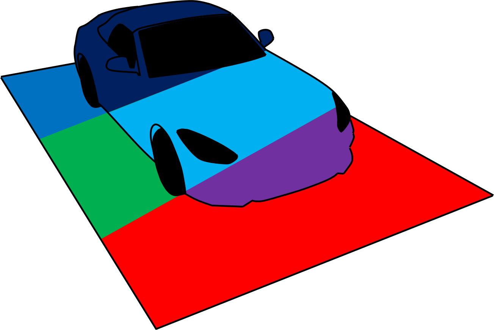

 OpenMATERIAL
============

The development of the OpenMATERIAL specifications for 3D models and materials is continued in the international standardization project **[ASAM OpenMATERIAL](https://www.asam.net/project-detail/asam-openmaterial/)** and its [project repository](https://github.com/asam-ev/OpenMATERIAL).

The path tracer rendering software and examples of 3D models and materials were moved to the repository [OpenMATERIAL-Validation](https://github.com/LudwigFriedmann/OpenMATERIAL-Validation).