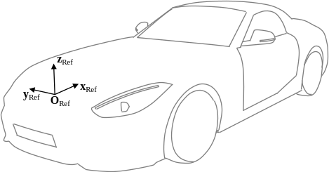
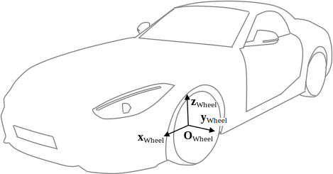
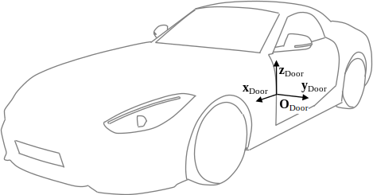
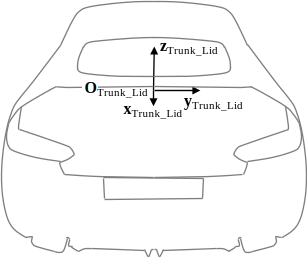
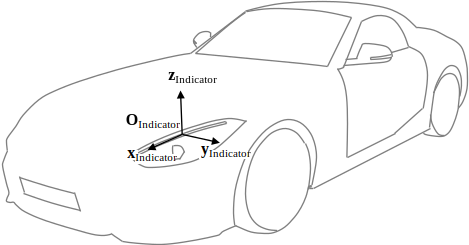
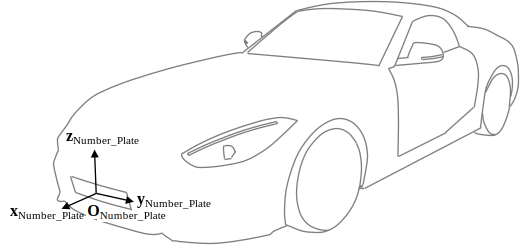
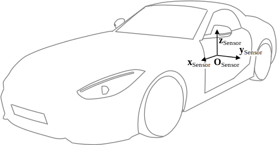
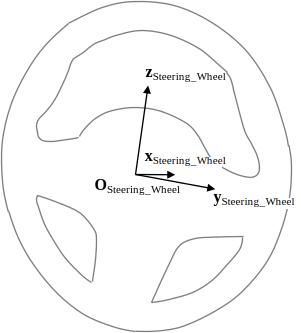

3D Model Structure
==================

# Vehicles

## 1.	Introduction

The following specification describes properties and a proposed model structure for 3D vehicle models in real-time simulation usage. Models incorporating specific equipment configurations may be extended by switchable nodes (not specified here) to represent these.

## 2.	General

Models shall be provided in the [Khronos glTF 2.0](https://github.com/KhronosGroup/glTF) file format. Their creation process shall comply with the requirements defined in [chapter 3](#3model-creation). While all models shall incorporate both interior and exterior, the engine compartment and other non-visible parts and cavities shall not be modeled. Joints and gaps (comprising grills, vents, ducts, etc.) shall be backfilled to prevent light bleeding. For the same reason, the models’ underbodies and wheel-arches shall be modeled closed.

Anticipating the quality requirements for model creation defined in [chapter 3.1](#31quality-requirements), here, some major requirements for the corresponding meshes are outlined:

*	Manual optimization (if required)
*	Consistent normals
*	Clean, optimized UV layout
*	Tile-able textures
*	Homogeneous distribution of vertices
*	No gaps or holes 

Model node structure shall comply with the structure presented in [chapter 3.2](#32model-structure). For external animation, the following transforms shall be implemented (see [chapter 3.3](#33transforms-and-coordinate-frames)):

*	Wheels: Kinematical animation of steering, rolling, camber and suspension deflection
*	Doors: Kinematical animation of opening/closing
*	Trunk lid: Kinematical animation of opening/closing
*	Lights: Positioning of external light sources 
*	Indicators: Positioning of external light sources
*	Number plates: Positioning of number plate geometries/textures
*	Sensors: Positioning of external sensor models
*	Steering wheel: Kinematical animation of the steering movement
*	Driver’s view: Positioning of external camera models in the driver’s eyepoint

## 3.	Model Creation

### 3.1	Quality Requirements

The following quality requirements were designed to meet the requirements of real-time simulation. This implies traffic simulation (of up to 100 vehicles) at interactive frame rates (60Hz) on COTS (commercial off-the-shelf) hardware. In a balance of power, the quality of the scene shall be granted in a way that, from a camera distance of half a meter, no visual artifacts shall be observable at the model surfaces for FullHD (1920 x 1080 px) renderings. In addition, the following recommendations concerning model quality requirements exist:

<div align="center">
   <i>Table 1: Quality requirements</i>
   <table>
      <tr><th>Requirement</th><th>Recommendation</th></tr>
      <tr><td><b>File Format 3D Model</b></td><td>glTF 2.0</td></tr>
      <tr><td><b>File Size 3D Model</b></td><td>< 100 Mb (including textures)</td></tr>
      <tr><td><b>Polygon Count</b></td><td>< 100-150k</td></tr>
      <tr><td><b>PBR Support</b></td><td>Metallic-Roughness</td></tr>
      <tr><td><b>File Format Textures</b></td><td>PNG, JPG</td></tr>
      <tr><td><b>Texture Resolution</b></td><td>2048 x 2048 px</td></tr>
      <tr><td><b>Scene</b></td><td>Right-handed coordinate frame:<br>+X pointing rightwards<br>+Y pointing upwards<br>-Z pointing forward from the origin<br>(asset “front” oriented in +Z direction)</td></tr>
   </table>
</div><br>

### 3.2	Model Structure

The model node hierarchy shall be consistent in structure and naming. Thus, within the model creation process, the following principles shall be obeyed:

Parametrization of manufacturer, type, and release:

*	*$Type*: Manufacturer_Type
*	*$Release*: Release

Consistent, hierarchical structure:

*	1st level (top Level): Floor, separation of interior and exterior
*	2nd level: Separation of static/dynamic content
*	3rd level: Static and dynamic assemblies
*	4th level: Component classification based on dynamic behavior (e.g. brake caliper/wheel)

Uniform nomenclature:

*	Snake_Case with capital letters at the beginning of each word
*	Group prefix (*Grp*)
*	Localization suffix
    * Front-Left (*FL*)
    * Front-Right (*FR*)
    * Side-Left (*SL*)
    * Side-Right (*SR*)
    * Back-Left (*BL*)
    * Back-Right (*BR*)  
    * Back-Center (*BC*)  
    * Front (*F*)
    * Back (*B*)

Based on the given requirements, the following model structure shall be used (transforms are indicated by *T*):
 
 ```
$Type_$Release (T)					
|-------Floor								
|-------Grp_Exterior			
| 	|-------Grp_Exterior_Static		
| 	|-------Grp_Exterior_Dynamic		
| 		|-------Grp_Wheel_FL (T)	
| 		| 	|-------Grp_Wheel_FL_Steering
| 		| 	|-------Grp_Wheel_FL_Steering_Rotating (T)
| 		|-------Grp_Wheel_FR (T)	
| 		| 	|-------Grp_Wheel_FR_Steering
| 		| 	|-------Grp_Wheel_FR_Steering_Rotating (T)
| 		|-------Grp_Wheel_BL (T)	
| 		| 	|-------Grp_Wheel_BL_Steering
| 		| 	|-------Grp_Wheel_BL_Steering_Rotating (T)
| 		|-------Grp_Wheel_BR (T)	
| 		| 	|-------Grp_Wheel_BR_Steering
| 		| 	|-------Grp_Wheel_BR_Steering_Rotating (T)
| 		|-------Grp_Door_FL (T)	
| 		|-------Grp_Door_FR (T)
| 		|-------Grp_Door_BL (T)	
| 		|-------Grp_Door_BR (T)	
| 		|-------Grp_Trunk_Lid (T)
| 		|-------Grp_Light_Low_Beam_FL (T)	
| 		|-------Grp_Light_Low_Beam_FR (T)	
| 		|-------Grp_Light_High_Beam_FL (T)	
| 		|-------Grp_Light_High_Beam_FR (T)	
| 		|-------Grp_Light_Park_FL (T)	
| 		|-------Grp_Light_Park_FR (T)	
| 		|-------Grp_Light_Park_BL (T)	
| 		|-------Grp_Light_Park_BR (T)	
| 		|-------Grp_Light_Tail_BL (T)	
| 		|-------Grp_Light_Tail_BR (T)	
| 		|-------Grp_Light_Brake_BL (T)	
| 		|-------Grp_Light_Brake_BC (T)	
| 		|-------Grp_Light_Brake_BR (T)	
| 		|-------Grp_Light_Reverse_BL (T)	
| 		|-------Grp_Light_Reverse_BR (T)	
| 		|-------Grp_Light_Fog_BL (T)	
| 		|-------Grp_Light_Fog_BR (T)	
| 		|-------Grp_Indicator_FL (T)	
| 		|-------Grp_Indicator_FR (T)	
| 		|-------Grp_Indicator_SL (T)	
| 		|-------Grp_Indicator_SR (T)	
| 		|-------Grp_Indicator_BL (T)	
| 		|-------Grp_Indicator_BR (T)	
| 		|-------Grp_Number_Plate_F (T)	
| 		|-------Grp_Number_Plate_B (T)
| 		|-------Grp_Convertible_Top
| 		|-------Grp_Sensors (T)
|-------Grp_Interior			
  	|-------Grp_Interior_Static		
  	|-------Grp_Interior_Dynamic		
  		|-------Grp_Steering_Wheel (T)
  		|-------Grp_Rear_Backrest
  		|-------Grp_Eyepoint_Female (T)	
  		|-------Grp_Eyepoint_Male (T)	
 ```
### 3.3	Transforms and Coordinate Frames

The model structure incorporates assembly-specific transforms which are used for kinematical animation of components (e.g. animation of wheels, doors, lids, steering wheel, etc.) and the positioning of external content (e.g. light sources, number plates, cameras etc.). Those transforms implement local coordinate frames.

All transforms are defined in the (global) reference coordinate frame of the model which acts as transform to the assembly *$Type_$Release*. The origin of this coordinate frame coincides with the origin of the vehicles’ construction coordinate frame:

<div align="center">
   <i>Table 2: Reference coordinate frame</i>
   <table>
      <tr><th colspan="2">Reference coordinate frame</th></tr>
      <tr><td><b>Origin (<i>O<sub>Ref</sub></i>)</b></td><td>Geometric center of the front axle</td></tr>
      <tr><td><b>x-axis (<i>x<sub>Ref</sub></i>)</b></td><td>Collinear with the vehicle longitudinal axis, pointing backwards</td></tr>
      <tr><td><b>y-axis (<i>y<sub>Ref</sub></i>)</b></td><td>Horizontally right-pointing (towards the passenger side)</td></tr>
      <tr><td><b>z-axis (<i>z<sub>Ref</sub></i>)</b></td><td>Perpendicular to the xy-plane, pointing upwards</td></tr>
  </table><br>
  <br>
  <i>Figure 1: Reference coordinate frame</i>
</div><br>

### 3.3.1 Wheels

For wheel animation (assemblies *Grp_Wheel_*), transforms are provided by the model structure. Those implement the following coordinate frame each:

<div align="center">
   <i>Table 3: Wheel coordinate frame</i>
   <table>
      <tr><th colspan="2">Wheel coordinate frame</th></tr>
      <tr><td><b>Origin (<i>O<sub>Wheel</sub></i>)</b></td><td>Geometric center of the wheel</td></tr>
      <tr><td><b>x-axis (<i>x<sub>Wheel</sub></i>)</b></td><td>Collinear with the vehicle longitudinal axis, pointing forwards</td></tr>
      <tr><td><b>y-axis (<i>y<sub>Wheel</sub></i>)</b></td><td>Completes the right-handed coordinate system</td></tr>
      <tr><td><b>z-axis (<i>z<sub>Wheel</sub></i>)</b></td><td>Perpendicular to the x-axis, pointing vertically upwards</td></tr>
   </table><br>
   <br>
   <i>Figure 2: Wheel coordinate frame</i>
</div><br>

As depicted, wheel rolling corresponds to a rotation around the y-axis (<i>R<sub>y</sub></i>) while steering is implemented by a rotation around the z-axis (<i>R<sub>z</sub></i>). Wheel camber is defined by a rotation around the x-axis (<i>R<sub>x</sub></i>). Finally, suspension deflection is represented by a translation along the z-axis (<i>T<sub>z</sub></i>). The corresponding neutral positions are defined as follows:

<div align="center">
   <i>Table 4: Wheel neutral position</i>
   <table>
      <tr><th colspan="2">Wheel neutral position</th></tr>
      <tr><td><b><i>R<sub>x</sub>=0</i></b></td><td>Camber at neutral load conditions</td></tr>
      <tr><td><b><i>R<sub>y</sub>=0</i></b></td><td>Rim logos horizontal, readable</td></tr>
      <tr><td><b><i>R<sub>z</sub>=0</i></b></td><td>Straight running</td></tr>
      <tr><td><b><i>T<sub>z</sub>=0</i></b></td><td>Suspension deflection at neutral load conditions</td></tr>
   </table>
</div><br>

### 3.3.2 Doors

For door animation (assemblies *Grp_Door_*), transforms are provided by the model structure. Those implement the following coordinate frames:

<div align="center">
   <i>Table 5: Door coordinate frame</i>
   <table>
      <tr><th colspan="2">Door coordinate frame</th></tr>
      <tr><td><b>Origin (<i>O<sub>Door</sub></i>)</b></td><td>Geometric center of the virtual hinge axis</td></tr>
      <tr><td><b>x-axis (<i>x<sub>Door</sub></i>)</b></td><td>Perpendicular to the z-axis, pointing forwards</td></tr>
      <tr><td><b>y-axis (<i>y<sub>Door</sub></i>)</b></td><td>Completes the right-handed coordinate system</td></tr>
      <tr><td><b>z-axis (<i>z<sub>Door</sub></i>)</b></td><td>Concentric and coaxial to the virtual hinge axis, pointing upwards</td></tr>
   </table><br>
   <br>
   <i>Figure 3: Door coordinate frame</i>
</div><br>

Here, the virtual hinge axis is the axis that allows the animation of the closing and opening of a door with a single rotation. It coincides with the z-axis (<i>z<sub>Door</sub></i>) of the door coordinate frame. For closing and opening the door in a rotation around the z-axis (<i>R<sub>z</sub></i>), the following neutral position is defined:

<div align="center">
   <i>Table 6: Door neutral position</i>
   <table>
      <tr><th colspan="2">Wheel neutral position</th></tr>
      <tr><td><b><i>R<sub>z</sub>=0</i></b></td><td>Door closed</td></tr>
   </table>
</div><br>

### 3.3.3 Trunk Lid

For trunk lid animation (assembly *Grp_Trunk_Lid*), a transform is provided by the model structure. It implements the following coordinate frame:

<div align="center">
   <i>Table 7: Trunk lid coordinate frame</i>
   <table>
      <tr><th colspan="2">Trunk lid coordinate frame</th></tr>
      <tr><td><b>Origin (<i>O<sub>Trunk_Lid</sub></i>)</b></td><td>Geometric center of the virtual hinge axis</td></tr>
      <tr><td><b>x-axis (<i>x<sub>Trunk_Lid</sub></i>)</b></td><td>Completes the right-handed coordinate system</td></tr>
      <tr><td><b>y-axis (<i>y<sub>Trunk_Lid</sub></i>)</b></td><td>Concentric and coaxial to the virtual hinge axis, pointing rightwards (towards the passenger side)</td></tr>
      <tr><td><b>z-axis (<i>z<sub>Trunk_Lid</sub></i>)</b></td><td>Perpendicular to the y-axis, pointing upwards</td></tr>
   </table><br>
   <br>
   <i>Figure 4: Trunk lid coordinate frame</i>
</div><br>

Here, the virtual hinge axis is the axis that allows the animation of the closing and opening of the trunk lid with a single rotation. It coincides with the y-axis (<i>y<sub>Trunk_Lid</sub></i>) of the trunk lid coordinate frame. For closing and opening the trunk lid in a rotation around the y-axis (<i>R<sub>y</sub></i>), the following neutral position is defined:

<div align="center">
   <i>Table 8: Trunk lid neutral position</i>
   <table>
      <tr><th colspan="2">Trunk lid neutral position</th></tr>
      <tr><td><b><i>R<sub>y</sub>=0</i></b></td><td>Trunk lid closed</td></tr>
   </table>
</div><br>

### 3.3.4 Lights

For light animation (assemblies *Grp_Light_*), i.e. positioning of corresponding light sources, transforms are provided by the model structure. Those implement the following coordinate frames:

<div align="center">
   <i>Table 9: Light coordinate frame</i>
   <table>
      <tr><th colspan="2">Light coordinate frame</th></tr>
      <tr><td><b>Origin (<i>O<sub>Light</sub></i>)</b></td><td>Geometric center of the last emitter/reflector along the optical path</td></tr>
      <tr><td><b>x-axis (<i>x<sub>Light</sub></i>)</b></td><td>Concentric and coaxial to the primary light propagation direction</td></tr>
      <tr><td><b>y-axis (<i>y<sub>Light</sub></i>)</b></td><td>Completes the right-handed coordinate system</td></tr>
      <tr><td><b>z-axis (<i>z<sub>Light</sub></i>)</b></td><td>Perpendicular to the x-axis, pointing upwards</td></tr>
   </table><br>
   <br>
   <i>Figure 5: Light coordinate frame</i>
</div><br>

### 3.3.5 Indicators

For indicator animation (assemblies *Grp_Indicator_*), i.e. positioning of corresponding light sources, transforms are provided by the model structure. Those implement the following coordinate frames:

<div align="center">
   <i>Table 10: Indicator coordinate frame</i>
   <table>
      <tr><th colspan="2">Indicator coordinate frame</th></tr>
      <tr><td><b>Origin (<i>O<sub>Indicator</sub></i>)</b></td><td>Geometric center of the last emitter/reflector along the optical path</td></tr>
      <tr><td><b>x-axis (<i>x<sub>Indicator</sub></i>)</b></td><td>Concentric and coaxial to the primary light propagation direction</td></tr>
      <tr><td><b>y-axis (<i>y<sub>Indicator</sub></i>)</b></td><td>Completes the right-handed coordinate system</td></tr>
      <tr><td><b>z-axis (<i>z<sub>Indicator</sub></i>)</b></td><td>Perpendicular to the x-axis, pointing upwards</td></tr>
   </table><br>
   <br>
   <i>Figure 6: Indicator coordinate frame</i>
</div><br>

### 3.3.6 Number Plates

For number plate animation (assemblies *Grp_Number_Plate_*), i.e. positioning of corresponding textures, transforms are provided by the model structure. Those implement the following coordinate frames:

<div align="center">
   <i>Table 11: Number plate coordinate frame</i>
   <table>
      <tr><th colspan="2">Number plate coordinate frame</th></tr>
      <tr><td><b>Origin (<i>O<sub>Number_Plate</sub></i>)</b></td><td>Geometric center of the number plate</td></tr>
      <tr><td><b>x-axis (<i>x<sub>Number_Plate</sub></i>)</b></td><td>Concentric and coaxial to the surface normal of the number plate</td></tr>
      <tr><td><b>y-axis (<i>y<sub>Number_Plate</sub></i>)</b></td><td>Completes the right-handed coordinate system</td></tr>
      <tr><td><b>z-axis (<i>z<sub>Number_Plate</sub></i>)</b></td><td>Perpendicular to the x-axis, pointing upwards</td></tr>
   </table><br>
   <br>
   <i>Figure 7: Number plate coordinate frame</i>
</div><br>

### 3.3.7 Convertible Tops

For convertible top animation (including soft-tops, assembly *Grp_Convertible_Top*), no specific transform is provided by the model structure. Instead, convertible tops are positioned in the reference coordinate frame. A convertible top assembly shall comprise 10 discrete states (animation frames) of the opening process. For soft-tops, these steps shall incorporate corresponding cloth representation. At the first, default state, the convertible top is closed. The last, tenth animation step always represents the fully opened convertible top. Eight uniformly distributed intermediate steps animate the opening or closing process.

### 3.3.8 Sensors

For positioning and simulation of sensors (assemblies *Grp_Sensors*), a transform is provided by the model structure. Following ISO 8855:2011, it implements the following coordinate frame:

<div align="center">
   <i>Table 12: Sensor coordinate frame</i>
   <table>
      <tr><th colspan="2">Sensor coordinate frame</th></tr>
      <tr><td><b>Origin (<i>O<sub>Sensor</sub></i>)</b></td><td>Geometric center of the rear axle, fixed in the sprung mass of the vehicle at neutral load condition</td></tr>
      <tr><td><b>x-axis (<i>x<sub>Sensor</sub></i>)</b></td><td>Collinear with the vehicle longitudinal axis, pointing forwards</td></tr>
      <tr><td><b>y-axis (<i>y<sub>Sensor</sub></i>)</b></td><td>Completes the right-handed coordinate system</td></tr>
      <tr><td><b>z-axis (<i>z<sub>Sensor</sub></i>)</b></td><td>Perpendicular to the x-axis, pointing upwards</td></tr>
   </table><br>
   <br>
   <i>Figure 8: Sensor coordinate frame</i>
</div><br>

### 3.3.9 Steering Wheel

For steering wheel animation (assembly *Grp_Steering_Wheel*), a transform is provided by the model structure. It implements the following coordinate frame:

<div align="center">
   <i>Table 13: Steering wheel coordinate frame</i>
   <table>
      <tr><th colspan="2">Steering wheel coordinate frame</th></tr>
      <tr><td><b>Origin (<i>O<sub>Steering_Wheel</sub></i>)</b></td><td>Intersection of steering axle and the plane defined by the steering wheel rim</td></tr>
      <tr><td><b>x-axis (<i>x<sub>Steering_Wheel</sub></i>)</b></td><td>Concentric and coaxial to the steering axle, pointing away from the driver</td></tr>
      <tr><td><b>y-axis (<i>y<sub>Steering_Wheel</sub></i>)</b></td><td>Completes the right-handed coordinate system</td></tr>
      <tr><td><b>z-axis (<i>z<sub>Steering_Wheel</sub></i>)</b></td><td>Perpendicular to the x-axis, pointing upwards</td></tr>
   </table><br>
   <br>
   <i>Figure 9: Steering wheel coordinate frame</i>
</div><br>

As depicted, steering movement corresponds to a rotation around the x-axis (<i>R<sub>x</sub></i>). The following neutral position is defined:

<div align="center">
   <i>Table 14: Steering wheel neutral position</i>
   <table>
      <tr><th colspan="2">Steering wheel neutral position</th></tr>
      <tr><td><b><i>R<sub>x</sub>=0</i></b></td><td>Straight running</td></tr>
   </table>
</div><br>

### 3.3.10 Backseat

For animation of the foldable backrest of the backseat (assembly *Grp_Rear_Backrest*), no specific transform is provided by the model structure. Instead, the backrest is referenced in the reference coordinate frame. A backrest assembly shall comprise 2 discrete states (animation frames) of the folding process. At the first, default state, the backrest is in upright position. The second state always represents the fully folded backrest.

### 3.3.11 Driver’s View

To represent the driver’s view (the so-called eyepoint) of a 95-percent female and a 95-percent male (assemblies *Grp_Eyepoint_*), transforms are provided by the model structure. They implement the following coordinate frames:

<div align="center">
   <i>Table 15: Eyepoint coordinate frame</i>
   <table>
      <tr><th colspan="2">Eyepoint coordinate frame</th></tr>
      <tr><td><b>Origin (<i>O<sub>Eyepoint</sub></i>)</b></td><td>Geometric center of the driver’s head</td></tr>
      <tr><td><b>x-axis (<i>x<sub>Eyepoint</sub></i>)</b></td><td>Collinear with the vehicle longitudinal axis, pointing forwards</td></tr>
      <tr><td><b>y-axis (<i>y<sub>Eyepoint</sub></i>)</b></td><td>Completes the right-handed coordinate system</td></tr>
      <tr><td><b>z-axis (<i>z<sub>Eyepoint</sub></i>)</b></td><td>Perpendicular to the x-axis, pointing upwards</td></tr>
   </table><br>
</div><br>
