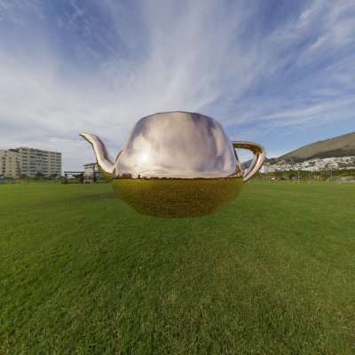
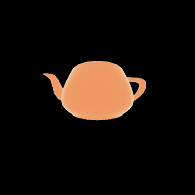

Physical pathtracer / raycaster
=================================

This project implements a pathtracer to demonstrate the capabilities of the proposed `OpenMaterial_material_parameters`
extension for the [Khronos Group glTF 2.0](https://github.com/KhronosGroup/glTF) file format.

The pathtracer loads an object (a 3D geometry) from a glTF file. Examples for geometry glTF files can be found in the folder
[`../objects/`](../objects/). In their `material` section, those files contain a link to other glTF files that provide the physical parameters
and the description of materials. This way, materials can be used by different geometries and vice versa.

The pathtracer renders a single picture. The physical parameters provided in the glTF material files in the folder
[`../materials/`](../materials/) (e.g., `aluminium.gltf`,`iron.gltf` or `gold.gltf`) are used to compute the reflection of rays at the
geometry. Corresponding light sources for this reflection are provided by a HDR (high definition range) background image.
The implemented camera model is a thin lens camera. The rendered output image is saved as a PPM (Portable Pixmap
format) file.

Besides its major use case as a pathtracer, the implementation provides the functionality of a raycaster. In this case,
reflections and secondary rays are neglected. Instead, material coefficients from the first ray-object intersection are
rendered to a monochromatic output image.

Compilation
-----------

The project source code can be compiled using [CMake](https://cmake.org/). On Linux systems, this requires the following commands:

```
$ mkdir bin
$ cd bin
$ cmake ..
$ make
```

The above will generate the executable `pathtracer` in the directory `bin/`. The code is written in C++11 and dependant on
[OpenMP](https://www.openmp.org/) for parallelization.

The project was tested on Ubuntu 18.04, Ubuntu 20.04 and Windows 10 (CMake & Visual Studio 2015). In the latter case,
the project can be compiled using:

``` 
$ mkdir bin
$ cd bin
$ cmake .. -G "Visual Studio 14 2015 Win64"
$ msbuild PathTracer.sln -property:Configuration=Release
```
 
As the code is pure C++11, the code should also compile and run on other platforms with compilers that support OpenMP.

Usage
-----

The pathtracer is executed using its command line interface. Running `pathtracer --help` will print usage instructions.
Mandatory parameters are `--input` or `-i` for the specification of the input glTF file, and `--hdr` for the specification of a
background HDR file.

The following example renders a golden teapot at a resolution of 1200x1200 pixels on a Linux machine:

```
$ bin/pathtracer --resolution 1200 --hdr ../hdr/green_point_park_4k.hdr --input ../objects/teapot_gold.gltf --output teapot_gold.ppm
Loading ../objects/teapot_gold.gltf
Loading material: gold:
gold:
    user_preferences:
        geometricalOptics: true
        includeDiffraction: false
        includeNumericalSimulation: false
        materialScheme: surface
        materialClassification: "solid-metal"
        materialType:
            isotropic: true
            homogeneous: true
            magnetic: false
        temperature: 300
        surfaceDisplacementUri: ""
        surfaceRoughness:
            surfaceHeight: 0
            surfaceCorrelationLength: 0
        lambertEmission: 0
        subsurface:
            subsurface: false
            subsurfaceThickness: 0
    physical_properties:
        refractiveIndexUri: "data/gold_ior.gltf"
        meanFreePath: 0
        particleDensity: 0
        particleCrossSection: 0
        emissivityCoefficientUri: ""
        applicableSensors:
            camera: true
            lidar: true
            radar: true

Loaded blender teapot
Rendering the scene...
Saving image to teapot_gold.ppm
```

The output image is saved as `teapot_gold.ppm`:

<p align="center"></p>

On Windows, the above example can be executed using

```
$ bin\Release\pathtracer.exe --resolution 1200 --hdr ..\hdr\green_point_park_4k.hdr --input ..\objects\teapot_gold.gltf --output teapot_gold.ppm
```

Raycaster
----------

The raycaster (command line option `-R`) uses the same executable and parameters as the pathtracer. The raycaster
renders material coefficients from the first ray-object intersection to a monochromatic output image:

<p align="center"></p>

While specification of an HDR image is not required in this case, adding command line option `-v` provides verbose
debug information.

Texture based displacement
-----------------------------------

Texture based mesh displacement is activated by using command line option `-d` and specification of corresponding textures
(e.g. from [`../materials/`](../materials/)).
  
```
$ bin/pathtracer -i <yourgltfmodel> -H <yourbackground> -d ../materials/paper_displacement.bmp
```

UV mapping is specified by adding the command line option `-U`:

```
$ bin/pathtracer -i <yourgltfmodel> -H <yourbackground> -d ../materials/paper_displacement.bmp -U <yourUVmapping>
```

Available options for UV mapping comprise `random` (default), `sphere`, `cube` and `cylinder`. Thus, reference examples
for texture based displacement can be created using the following commands:

Sphere
```  
$ bin/pathtracer -H <yourfile.hdr> -i ../objects/sphereEnriched_aluminium.gltf -d <yourmap> -U sphere  
```
Cube  
```
$ bin/pathtracer -H <yourfile.hdr> -i ../objects/cubeEnriched_aluminium.gltf -d <yourmap> -U cube  
```
Cylinder  
```
$ bin/pathtracer -H <yourfile.hdr> -i ../objects/cylinderEnriched_aluminium.gltf -d <yourmap> -U cylinder  
```

Testing
--------

Unit tests are executed using the command line option `-t`.  

Documentation
-------------

Source code documentation is generated using doxygen:

```
doxygen doxygen.conf
```

Documentation will be written to the `docs/` directory.

Further details
---------------

* Camera model: Pinhole camera
* Available materials: Metals
* Illumination: Given by a background HDR image
* Rendering:
  - Each ray consists of three wavelengths (red 650nm, green 510nm, blue 440nm)
  - Light is assumed to be unpolarized.
  - The reflection coefficients (the Fresnel coefficients) are computed as the mean of s- and p-polarization.

Third party software
--------------------

This project depends on third party software. The corresponding code can be found in  the directory [`../external/`](../external/).
